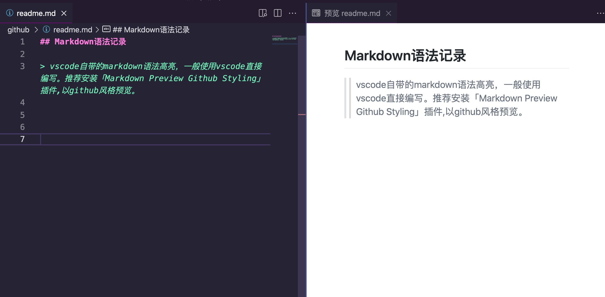
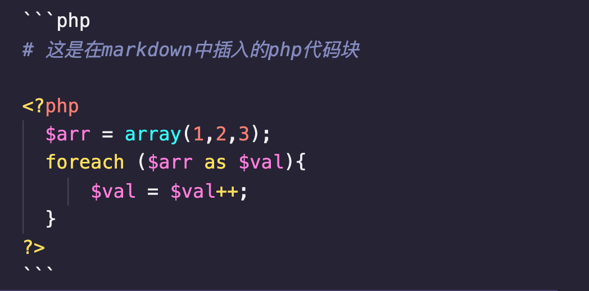

## Markdown语法记录

>vscode自带的markdown语法高亮，一般使用vscode直接编写。推荐安装「Markdown Preview Github Styling」插件,以github风格预览。
-----------------------------------


### 一、标题

# 一级标题
`# 一级标题`

## 二级标题
`## 二级标题`

### 三级标题
`### 三级标题`

当行分割线二级标题
---
`当行分割线二级标题`

`---`

双行分割线一级标题
===
`双行分割线一级标题`

`===`

### 二、强调

~~删除线~~

`~~删除线~~`

_斜体_ 有2种表现形式

```_斜体_或者*斜体*```

__加粗__ 有2种表现形式

```__加粗__或者**加粗**```

### 三、列表

列表表现形式  
   - 第一行形式
   * 第二行形式
   + 第三行形式

代码如下：

   ```
   列表表现形式
   
   - 第一行形式
   
   * 第二行形式
   
   + 第三行形式
   ```

### 四、链接

1.超链接

- 方括号内显示超链接的文字，圆括号内是点击的url
- [这是一个超链接](http://www.google.com)

`[这是一个超链接](http://www.google.com)`

2.最简单超链接
- 直接显示url的超链接 <http://www.google.com>

`<http://www.google.com>`

### 五、图片

- `语法: `
- 图片alt表示图片无法加载时显示的内容
- url可以使用相对路径，也可以使用绝对路径
- title表示鼠标移上去显示的内容，可加可不加


``

### 六、代码块
 
1.单行代码

- 语法时用 `` 包围想要高亮显示的代码块

`loading...`

``` 代码为：`loading...` ``` 


2.多行代码

- 用 `````` 包围所有代码，可以在第一行中给出代码使用的具体语言

```php
# 这是在markdown中插入的php代码块

<?php
  $arr = array(1,2,3);
  foreach ($arr as $val){
      $val = $val++;
  }
?>
```


### 七、表格

```
语法：

表头1 ｜ 表头2 ｜ 表头3
- ｜ -｜ -｜
内容1 ｜ 内容2 ｜ 内容3
内容4 ｜ 内容5 ｜ 内容6

# 用｜分割列，用 一个或者多个 - 分割行

- 对齐方式
可以用冒号 ：在短划线两旁标识单元格对齐方式
在短划线右边表明右对齐： ---:
在短划线左边表明左对齐： :---
两边都有表示居中对齐： :---:

表头1 ｜ 表头2 ｜ 表头3
:--- ｜ :---:  | ---:
左对齐 ｜ 居中对齐 ｜ 右对齐 

```

- 表格1

姓名 | 年龄 |成绩
- | - | -
张三 | 13岁 | 99分
李四 | 14岁 | 100分

- 表格2

我是左对齐 | 我是居中对齐 | 我是右对齐
:--- | :---: | ---:
第一列是 | 根据长短对齐1111 | 封城了
第二列是 | 北京欢迎你2222 | 可惜了

### 八、引用

- 用 > 引入一段引文，markdown可以根据字符长短在渲染时恰当地处理换行。

> 这就是第一段引用

- 代码如下：

` > 这就是第一段引用 `


